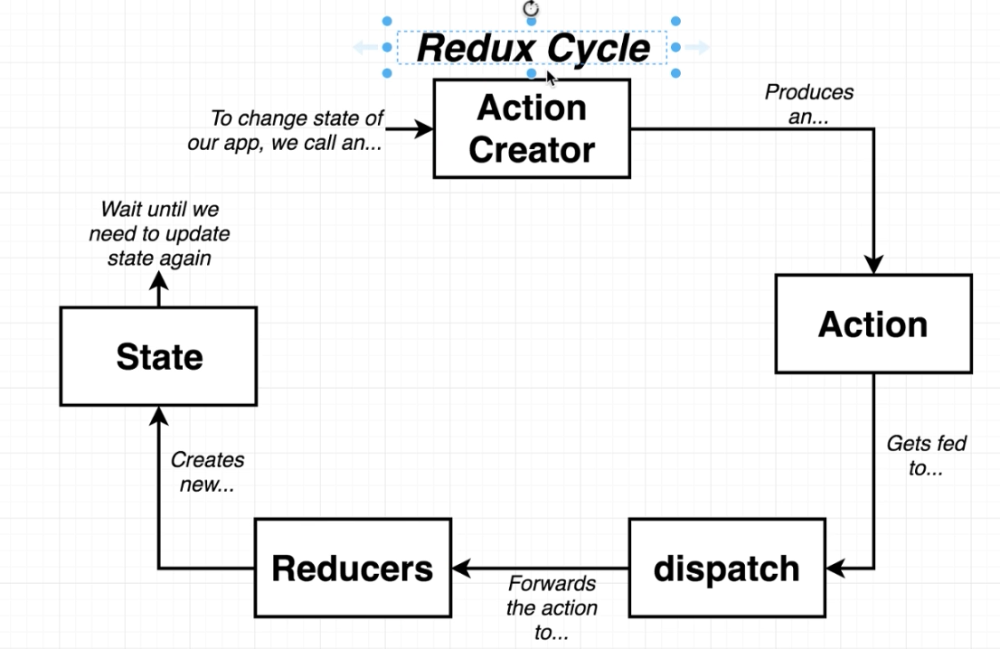
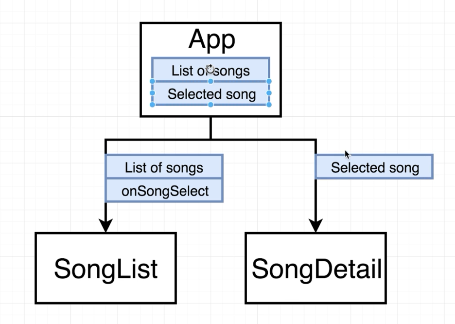
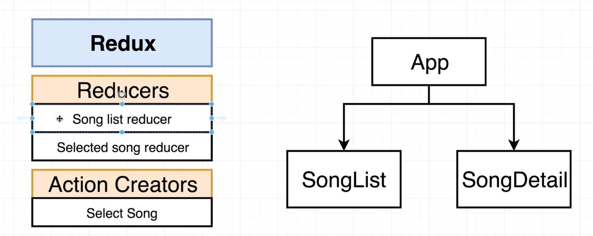
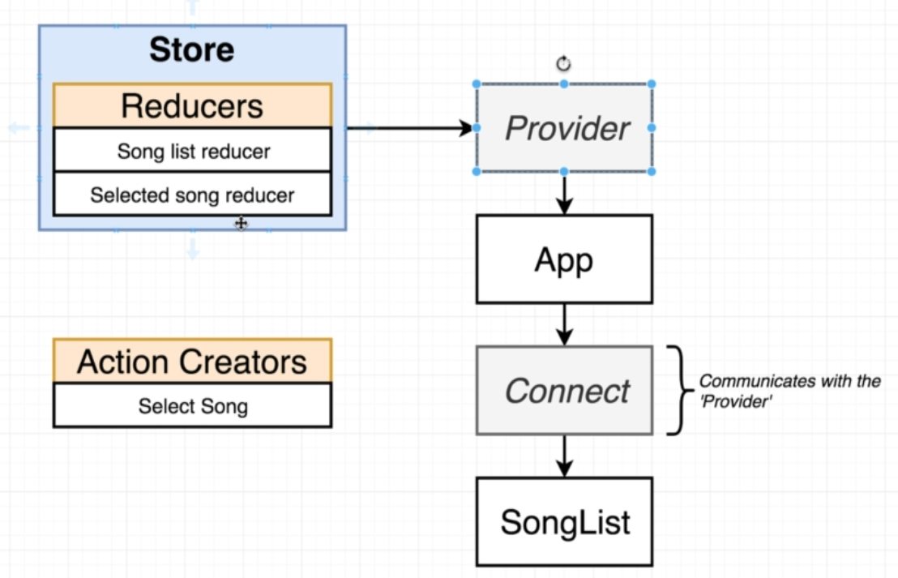
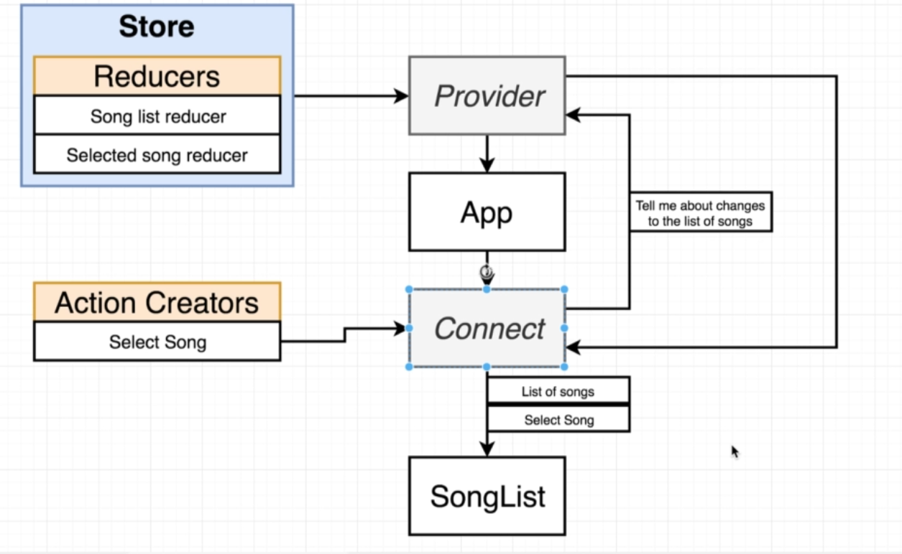
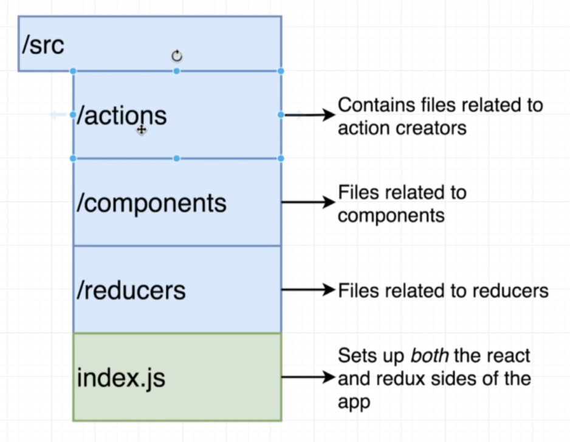

# Redux

Redux is a state management library generally used with `react`.

## Redux Cycle

**1. Action Creators -** Action creators are the functions that create an action ( _like people dropping of a form in the insurance company analogy_ )

**2. Action -** Action is what gets created by a action creator ( _like the form_ ) which contains a `type` and a `payload` property. The type contains what the action does and the payload contains properties about how to do that action.

```javascript
// People dropping off a form (Action Creators)
const createPolicy = (name, amount) => {
	return {
		// Action (a form in our analogy)
		type: 'CREATE_POLICY',
		payload: {
			name: name,
			amount: amount,
			// could also just use the es5 syntax of just passing in the name
		},
	};
};
```

**3. Dispatch -** Dispatch is already available inside the redux library so we don't need to write code for it. It makes copies of our action and pass if of to different places inside our application.( _the dispatch is like the form receiver which makes copies & later distributes it_ )

**4. Reducers -** Reducers are responsible for taking in an action and some existing amount of data and to process the action and then return it so that it can then be centralized in some other location.

```javascript
const claimsHistory = (oldListOfClaims = [], action) => {
	if (action.type === 'CREATE_CLAIM') {
		// we care about this action (FORM!)
		return [...oldListOfClaims, action.payload];
	}

	// we don't care the action (form!!)
	return oldListOfClaims;
};
```

**Remember to always return a new array and also to provide a default value of an empty array for the first time it gets called.**

**5. State -** State is the central repository of data that has been created by the `reducers`.

**_Redux workflow_**

```javascript
const { createStore, combineReducers } = Redux;
const reducers = combineReducers({
	claimsHistory: claimsHistory,
	// all other reducers
});
const store = createStore(reducers);
const action = createPolicy('Chirag', 19);
store.dispatch(action); // can also pass the createPolicy action directly as well
store.getState(); // current state which includes all the data.
```

Each dispatch creates a new cycle.



**Remember we can only modify the state in redux through the dispatch function by dispatching an action that has been created by an action creator.**

## Song App

### Without Redux

`use git checkout master` to see the basic app.



### With Redux



**_Remember how only action creators can change the state in redux therefore `Select song` is going to be a action creator_**

### BTS



- The provider is passed in the state from the store as a prop which wraps the App component.

- The Connect Tag/Function/Component wraps the Song List component and also communicates with the Provider component using the context API ( which basically allows a parent component like `Provider` to communicate with any child component like `Connect` even if there are other child component b/w them such as the `App` component. )

  

#### File Structure


